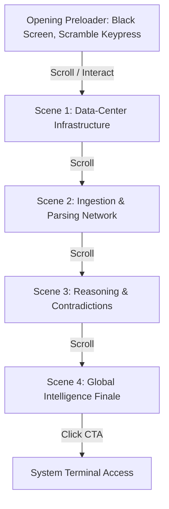

# BLACKBOX // Interactive Cinematic Experience Specification

This document details the architectural sitemap, visual mechanics, sountrack/audio cues, video mask/blending logic, scroll-tied timeline configurations, and performance constraints for the **BLACKBOX Opening Sequence**.

---

## 1. Core Philosophy
*   **Narrative over Marketing**: This is NOT a marketing landing page or AI SaaS template. It is an interactive digital art piece designed to look and feel like a classified intelligence operating system console.
*   **Cinematic Direction**: Avoid cards, icon grids, pricing tables, testimonials, and accordion FAQs. Use editorial typography, vast negative space, high contrast, perspective depth, and scrolling camera motion to convey scale, precision, and secrecy.
*   **Dynamic Media Masking**: Videos are never used as simple background loops. They are masked, blended with noise and particle overlays, and dynamically controlled via scroll progression.

---

## 2. Interactive Act & Scene Structure



### Preloader: System Ingress
*   **Visuals**: Absolute black screen. Subtle film grain overlay. A single cursor blinking at the top left.
*   **Telemetry Text**: 
    ```
    SECURE TERMINAL // PORT 443
    RESTRICTED TO LEVEL 4 CLEARANCE
    PRESS ANY KEY TO INITIATE SYSTEM BOOT
    ```
*   **Interaction**: Pressing any key or clicking the screen triggers a decrypt sequence: character scrambling ticks upwards as lines of system log parameters execute. Sound of a mechanical relay clicking.
*   **Transition**: Screen fades slightly to reveal a sparse, floating 3D particle field.

### Scene 1: Infrastructure (Data-Center)
*   **Video Asset**: `public/assets/data-center.mp4`
*   **Blending & Masks**: Rendered inside a circular/rectangular clipping path or horizontal slit mask. Layered with:
    - High-frequency film grain.
    - Dotted grid overlay.
    - Drifting telemetry coordinates ticking on the borders.
*   **GSAP Timeline**: As you scroll:
    - The video mask expands vertically (curtain reveal).
    - Camera drifts forward into the grid.
    - Large typography `INFRASTRUCTURE` slides out of a clipping mask.

### Scene 2: Evidence & Extraction (Network)
*   **Video Asset**: `public/assets/network.mp4`
*   **Blending & Masks**: Blended in `screen` mode over the black background. Particle coordinates are generated programmatically on top of the video nodes.
*   **GSAP Timeline**: Scroll controls the playback rate of the video.
    - Mapped nodes (Names, Phones, Emails, Transactions) animate on screen in sync with the video highlights.
    - Decryption values scramble and lock into place: `ALIAS: OMEGA`, `IP_SUBNET: 198.51.100.82`.

### Scene 3: Knowledge & Reasoning (Network-2)
*   **Video Asset**: `public/assets/network-2.mp4`
*   **Blending & Masks**: Green/white chromatic aberration transitions.
*   **GSAP Timeline**: As scroll deepens:
    - Contradictory connection paths illuminate in warning colors (`#d4a017`).
    - Confidence score metrics increment in real-time.
    - Text blocks slide in, describing the cognitive reasoning layers.

### Scene 4: Global Intelligence Finale (Globe)
*   **Video Asset**: `public/assets/globe.mp4`
*   **Blending & Masks**: Full canvas blending with high-contrast vignette edges.
*   **GSAP Timeline**: 
    - The camera pulls back, showing the local network expanding and wrapping around the rotating globe.
    - Cinematic title fade-in: `BLACKBOX // INTELLIGENCE OPERATING SYSTEM`.
    - Secure ACCESS CTA emerges.

---

## 3. Motion Language & Physics
*   **Damping & Inertia**: No bouncy transitions or playful overshoots. Easing curves are calculated via slow-in, fast-out exponential decelerations: `cubic-bezier(0.16, 1, 0.3, 1)` or GSAP `power4.out`.
*   **Camera Path**: Emulate a physical camera crane. Moves should be restricted to slow, continuous drifts along the Z-axis (zoom-depth) and Y-axis rotations.
*   **Accessibility**: Respect `prefers-reduced-motion`. In reduced-motion mode, high-frequency animations (like particle drifts, grid rotation, and video scrubbing) are converted to static fading transitions.

---

## 4. Technical Stack & Performance Targets
*   **Orchestration**: GSAP 3 + ScrollTrigger for scroll-pinned timelines.
*   **Smooth Scroll**: Lenis for momentum scroll control, locked to requestAnimationFrame loops.
*   **Render Optimization**:
    - Video assets are initialized with `preload="auto"` and muted.
    - Render loops (including canvas particle systems) are paused when they scroll out of the viewport.
    - `requestVideoFrameCallback` is used if available to sync custom canvas draw calls with video frame decodes.
    - Capped device pixel ratio to a maximum of `2` to prevent layout thrashing on high-density screens.
